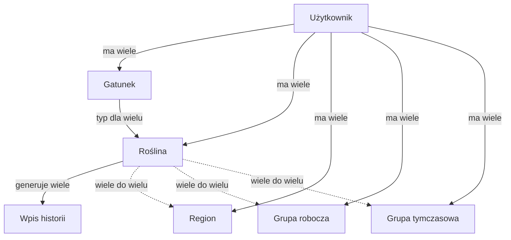
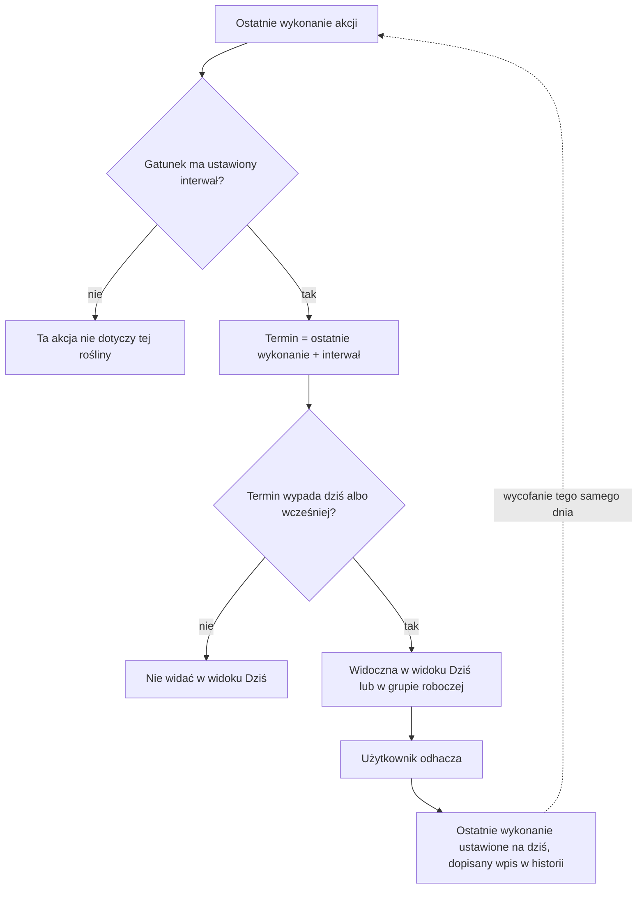

# Grow — domena

Model domeny aplikacji do zarządzania uprawą roślin.

## Kontekst i aktorzy

Aplikacja obsługuje wielu niezależnych użytkowników — każdy ma w pełni
odizolowane dane. Użytkownik jest właścicielem swoich roślin, gatunków i grup
bezpośrednio.

## Sedno domeny

Trzy elementy domeny działają razem:

1. Codzienna odpowiedź na pytanie, co dziś podlać albo nawieźć.
2. Praca grupowa — przy kilkudziesięciu roślinach liczy się, ile pracy czeka
   w danej lokalizacji, oraz możliwość odhaczenia wielu roślin naraz zamiast
   klikania każdej z osobna.
3. Historia uprawy, budowana z każdego codziennego działania i dostępna do
   ręcznego przeglądu — docelowo może też posłużyć raportom czy eksportowi
   do CSV.

## Język domeny

| Pojęcie | Znaczenie |
| --- | --- |
| Gatunek | Typ rośliny zdefiniowany przez użytkownika, np. „Papryka" czy „Jalapeño". Gatunki są sobie równorzędne, bez relacji nadrzędno-podrzędnej — każdy nosi własną konfigurację interwałów akcji cyklicznych. Widoczny tylko dla właściciela. |
| Roślina | Pojedynczy egzemplarz. Ma gatunek, kod, przynależność do regionów i grup oraz własne daty ostatnich akcji cyklicznych. |
| Kod | Czytelny identyfikator rośliny (np. `PJ03`), pełniący rolę fizycznej etykiety na doniczce. Unikalny w całym ogrodzie użytkownika i niezmienny po utworzeniu — nadany ręcznie albo wygenerowany przez aplikację. |
| Region | Etykieta lokalizacji, np. „Balkon", „Szklarnia". Roślina może należeć do kilku regionów naraz (np. „Balkon" i „Mieszkanie" jednocześnie), dzięki czemu widać zarówno pracę na balkonie, jak i sumę dla całego domu. Spójność pilnuje użytkownik — system jej nie wymusza. |
| Grupa robocza | Długoterminowe zgrupowanie roślin o podobnej lokalizacji lub interwale, do zbiorczego odhaczania pracy. Może mieć wyrównany harmonogram (patrz niżej). |
| Grupa tymczasowa | Krótkotrwała lista roślin do jednorazowej akcji w najbliższym czasie, np. wykryta choroba albo planowane przesadzenie. Członkostwo jest wyłącznie ręczne — w obie strony. |
| Akcja cykliczna | Powtarzalna czynność, której interwał określa gatunek. Docelowo ma to być w pełni konfigurowalny przez użytkownika zestaw czynności; na razie ograniczony do podlewania i nawożenia — najczęstszych i najprostszych do odhaczenia. |
| Termin | Data ostatniego wykonania akcji cyklicznej powiększona o interwał gatunku. Bez interwału albo bez wcześniejszego wykonania termin nie istnieje. |
| Wykonanie akcji | Odhaczenie akcji cyklicznej, pojedynczo albo dla całej grupy. Ustawia datę ostatniego wykonania na dziś i dopisuje wpis do historii. |
| Wycofanie | Cofnięcie wykonania z bieżącego dnia. Przywraca poprzednią datę ostatniego wykonania — to więcej niż ukrycie znacznika „zrobione". |
| Wyrównanie harmonogramu | Gdy rośliny w grupie roboczej mają wspólny interwał, ale rozjechane terminy (np. bo rośliny dosadzono później), wyrównanie wymusza jeden, wspólny termin dla wszystkich. |
| Zdarzenie jednorazowe | Wpis w historii spoza harmonogramu: dodanie, przesadzenie (opcjonalnie nowy rozmiar doniczki), podcinanie i zbiór (opcjonalnie ilość i/lub waga — nigdy niewymagane). Użytkownik może też dopisać dowolne zdarzenie własne. |
| Historia uprawy | Chronologiczny dziennik zdarzeń rośliny, tylko do odczytu. To z niego wynika, do jakiego stanu wraca wycofanie. |
| Użytkownik | Właściciel swoich roślin, gatunków i grup. Dane innych użytkowników są dla niego niewidoczne. |

## Model bytów

Poniższy diagram pokazuje, jak łączą się poszczególne byty:

Ciągłe strzałki oznaczają zwykłe przypisanie: jeden właściciel, wiele
elementów. Przerywane strzałki oznaczają relację wiele do wielu — roślina
może należeć do kilku regionów i kilku grup naraz, a każdy region czy każda
grupa może obejmować wiele roślin. Tę przynależność można zmieniać w
dowolnym momencie — to zwykła edycja struktury, bez śladu w historii uprawy.

## Termin i wycofanie

Poniższy diagram pokazuje, jak liczony jest termin kolejnej akcji i co
dzieje się po wycofaniu:

## Procesy

**Dodanie rośliny.** Wybór gatunku, opcjonalny kod własny lub wygenerowany,
przypisanie regionów i grup. Powstaje wpis „dodano" w historii.

**Dziś.** Lista roślin z terminem dziś albo zaległym, do odhaczenia
pojedynczo lub zbiorczo. Odhaczenie przesuwa termin i dopisuje historię.
Wycofanie tego samego dnia przywraca stan sprzed kliknięcia.

**Praca grupowa.** Grupa robocza pokazuje, ilu członków ma dziś zaległą
akcję, z opcją odhaczenia samych zaległych albo wszystkich naraz. Przy
wspólnym interwale i rozjechanych terminach można je wyrównać. Regiony dają
wgląd w obciążenie pracą w danej lokalizacji, a przy zazębiających się
regionach — także sumaryczny.

**Zdarzenia jednorazowe.** Przesadzenie, podcinanie i zbiór — z opcjonalnymi
danymi dodatkowymi, które można pominąć. Do tego dowolne zdarzenie własne.

**Grupy tymczasowe.** Oznaczenie roślin wymagających uwagi, praca z listą,
ręczne usunięcie po rozwiązaniu sprawy.

**Przegląd historii.** Ręczny, z poziomu rośliny.
